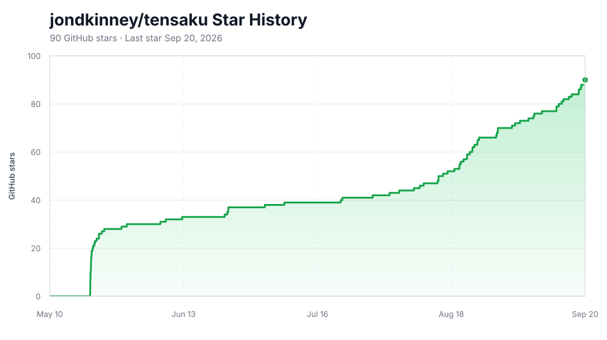

#  Tensaku: Modern Screenshot Annotation.

Tensaku is a screenshot annotation tool inspired by [Swappy](https://github.com/jtheoof/swappy) and [Flameshot](https://flameshot.org/).

> **Tensaku is a fork of [Satty](https://github.com/Satty-org/Satty)** by Matthias Gabriel, used under the MPL-2.0 license. See [`NOTICE`](NOTICE) for attribution details — thanks to the Satty project and its contributors for the foundation this builds on.


Tensaku provides:

- a simple, easy-to-understand toolset (like Swappy)
- fullscreen annotation mode and post-shot cropping (like Flameshot)
- extremely smooth rendering thanks to HW acceleration (OpenGL)
- support for wlroots-based compositors (Sway, Hyprland, River, ...)
- a minimal, modern-looking UI, thanks to GTK and Adwaita

## What Tensaku adds

Tensaku extends Satty with a number of new capabilities:

- **Movable annotations** — select, move, resize, multi-select, duplicate, and delete annotations *after* drawing them with the Pointer tool. The Arrow tool also gains Standard, Pointy, Curved, and Double styles.
- **Scrolling screenshots** — capture content taller than the screen. `tensaku --scroll-capture` opens a fullscreen overlay; drag-select a region, then capture by manual or automatic scrolling, and the frames are stitched into one tall image on the annotation canvas.
- **Layers panel** — treat annotations as layers you can reorder, lock, hide, rename, and drag-and-drop. Toggle it with <kbd>Ctrl+L</kbd>.
- **Paste images** — <kbd>Ctrl+V</kbd> drops a clipboard image onto the canvas as a resizable layer.
- **Spotlight tool** — dim the screenshot everywhere except the regions you highlight.
- **Redaction-grade blur** — the Blur tool adds irreversible *Secure Blur* and *Black Out* styles alongside Gaussian and Pixelate.
- **Zoom** — zoom the canvas with <kbd>Ctrl</kbd>+scroll or the <kbd>Ctrl</kbd>+digit shortcuts, with an on-screen zoom indicator.
- **Reworked crop** — aspect-ratio presets, exact width/height entry, rotate and flip, a background-color matte, and pan/zoom while cropping.
- **Reworked color picker** — a swatch grid with drag-to-reorder custom colors that persist across launches.
- **Preferences dialog** — open with <kbd>Ctrl+,</kbd> to rebind tool shortcuts and toggle behaviors; the same values can be edited in `config.toml`.

## Install

### Arch Linux (AUR)

Tensaku is published on the [AUR](https://aur.archlinux.org/packages/tensaku):

```sh
yay -S tensaku   # or: paru -S tensaku
```

### cargo

```sh
cargo install tensaku
tensaku --install-desktop   # add the icon + desktop entry
```

This builds from source, so it needs a Rust toolchain and the GTK-4 / Adwaita native dependencies — see [Dependencies](#dependencies). `cargo install` places only the binary; `tensaku --install-desktop` then registers the icon and `.desktop` entry under `~/.local/share/` (launcher icon, file associations) — the AUR package and `make install` do this already.

### Pre-built binary and Flatpak

Each [GitHub release](https://github.com/jondkinney/tensaku/releases) attaches an x86-64 Linux tarball and a Flatpak bundle:

```sh
flatpak install tensaku-<version>.flatpak
```

### From source

```sh
git clone https://github.com/jondkinney/tensaku.git
cd tensaku
make build-release              # binary at ./target/release/tensaku
PREFIX=/usr/local make install  # optional: install system-wide
```

See [Dependencies](#dependencies) and [Build from source](#build-from-source) for the full dependency list and uninstall instructions.

## Usage

Start by providing a filename or a screenshot via stdin (or use `--scroll-capture`, below) and annotate using the available tools. Save to clipboard or file when finished. Tools and interface have been kept simple.

Tensaku resolves its settings from two layers:

- **`config.toml`** — the persistent source of truth, normally at `~/.config/tensaku/config.toml` (see [Configuration File](#configuration-file)). You can edit it by hand or use the Preferences dialog; Preferences updates only the relevant keys and preserves unrelated settings and comments.
- **Command-line flags** — supply startup overrides for one invocation and are never written back automatically (see [Command Line](#command-line)). If you explicitly change the corresponding control in Preferences during that run, that live edit takes effect and is saved to `config.toml`.

`~/.local/state/tensaku/state.toml` is reserved for incidental editor state such as the last color, custom colors, saved per-tool sizes/fills, panel width, and the compositor-managed global scroll-capture shortcut. It is not a second preference layer.

### Shortcuts

- <kbd>Enter</kbd>: as configured (see below), default: copy-to-clipboard (may be masked by active tool)
- <kbd>Esc</kbd>: as configured (see below), default: no global close action (active tools can still use Esc to cancel)
- <kbd>Delete</kbd> reset (clear) <sup>experimental</sup> <sup>0.20.1</sup>
- <kbd>Ctrl+C</kbd>: Save to clipboard (may be masked by active tool)
- <kbd>Ctrl+Shift+D</kbd> or <kbd>Ctrl+Shift+I</kbd>: Open GTK inspector if not already opened
- <kbd>Ctrl+S</kbd>: Save to specified output file
- <kbd>Ctrl+Shift+S</kbd>: Save using file dialog <sup>0.20.0</sup>. The dialog uses `output-filename` as initial filename/path when available and remembers the last selected folder. <sup>0.21.0</sup>
- <kbd>Ctrl+Alt+C</kbd>: Copy last saved filepath to clipboard <sup>0.20.1</sup>
- <kbd>Ctrl+T</kbd>: Toggle toolbars
- <kbd>Ctrl+L</kbd>: Toggle the layers panel (configurable — see `layer-panel-shortcut`)
- <kbd>Ctrl+,</kbd>: Open Preferences
- <kbd>Ctrl+Y</kbd>: Redo
- <kbd>Ctrl+Z</kbd>: Undo
- <kbd>Ctrl+D</kbd>: Delete the selected annotation(s) — same as <kbd>Delete</kbd>, but reachable with the left hand
- <kbd>Alt+D</kbd>: Duplicate the selected annotation(s)
- <kbd>Ctrl</kbd>+scroll, or <kbd>Ctrl</kbd>+<kbd>+</kbd>/<kbd>-</kbd>: Zoom the canvas in/out
- <kbd>Ctrl+0</kbd>: Reset zoom to 100%; <kbd>Ctrl+1</kbd>: fit to window; <kbd>Ctrl+2</kbd>–<kbd>5</kbd>: zoom to 200–500%; <kbd>Ctrl+9</kbd>: zoom to 50%
- <kbd>Alt</kbd>+(<kbd>Left</kbd>/<kbd>Right</kbd>/<kbd>Up</kbd>/<kbd>Down</kbd>): Pan, also available with middle mouse button drag <sup>0.20.1</sup>

#### Color Selection Shortcuts <sup>0.20.1</sup>

<kbd>1</kbd>, <kbd>2</kbd>, <kbd>3</kbd>, …, <kbd>9</kbd>, <kbd>0</kbd> — select nth color from the color palette

#### Tool Selection Shortcuts (configurable) <sup>0.20.0</sup>
Default single-key shortcuts:
- <kbd>v</kbd>: Pointer tool
- <kbd>x</kbd>: Crop tool
- <kbd>z</kbd>: Brush tool
- <kbd>s</kbd>: Line tool
- <kbd>a</kbd>: Arrow tool
- <kbd>r</kbd>: Rectangle tool
- <kbd>e</kbd>: Ellipse tool
- <kbd>t</kbd>: Text tool
- <kbd>c</kbd>: Numbered Marker tool
- <kbd>b</kbd>: Blur tool
- <kbd>w</kbd>: Highlighter tool
- <kbd>g</kbd>: Spotlight tool

These defaults all sit on the **left half of a QWERTY keyboard** by design — you can switch tools one-handed while your right hand stays on the mouse. That makes Tensaku comfortable to drive on split keyboards and for left-hand-only use, and it's why the duplicate / delete chords are <kbd>Alt+D</kbd> / <kbd>Ctrl+D</kbd> rather than keys on the far side of the board.

Shortcuts can be rebound either in the `[keybinds]` section of `config.toml` (see below) or, more conveniently, in the [Preferences dialog](#preferences-dialog) (<kbd>Ctrl+,</kbd>). Each binding is a single character.

### Tool Modifiers and Keys

- Pointer: Click an annotation to select it, drag to move it, and drag a handle to resize it (hold <kbd>Shift</kbd> on a corner handle to keep the aspect ratio, or on a side handle to resize symmetrically about the center). Multiple annotations can be selected and moved together; <kbd>Ctrl+A</kbd> selects all and arrow keys nudge the selection.
- Arrow: Hold <kbd>Shift</kbd> to make arrow snap to 15° steps
- Ellipse: Hold <kbd>Alt</kbd> to center the ellipse around origin, hold <kbd>Shift</kbd> for a circle
- Highlight: Hold <kbd>Shift</kbd> to snap segments to 15° steps. The Highlighter has two styles — freehand, and a "smart" mode that snaps to lines of text — switched from the toolbar's style menu or by double-tapping <kbd>w</kbd>.
- Line: Hold <kbd>Shift</kbd> to make line snap to 15° steps
- Rectangle: Hold <kbd>Alt</kbd> to center the rectangle around origin, hold <kbd>Shift</kbd> for a square
- Text:
  - Press <kbd>Shift+Enter</kbd> to insert line break.
  - Combine <kbd>Ctrl</kbd> with <kbd>Left</kbd> or <kbd>Right</kbd> for word jump or <kbd>Ctrl</kbd> with <kbd>Backspace</kbd> or <kbd>Delete</kbd> for word delete.
  - Press <kbd>Enter</kbd> or switch to another tool to accept input, press <kbd>Escape</kbd> to discard entered text.
  - <kbd>Home</kbd> and <kbd>End</kbd> go to the start/end of current line or previous/next line if already on first/last character of line (automatic wrapping is not considered for this). <kbd>Ctrl</kbd> with <kbd>Home</kbd>/<kbd>End</kbd> jumps to start/end of text buffer.
  - <kbd>Up</kbd> or <kbd>Down</kbd> to jump to previous/next line (if already on first/last line, it jumps to the start/end of text buffer). <sup>0.20.1</sup>
  - Combine <kbd>Shift</kbd> with other keys to select text (e.g. `Shift+Home` to select from start of line to cursor,  <kbd>Shift+Left</kbd> to select characters before cursor,  <kbd>Ctrl+Shift+Left</kbd> to select words before cursor,and so on) <sup>0.20.1</sup>
  - <kbd>Double-click </kbd> to select word under cursor.Triple-click to select all text. <sup>0.20.1</sup>
  - <kbd>Ctrl+A</kbd> to select all text. <sup>0.20.1</sup>
  - <kbd>Ctrl+C</kbd> to copy selected text to clipboard. <sup>0.20.1</sup>
  - <kbd>Ctrl+X</kbd> to cut selected text to clipboard. <sup>0.20.1</sup>
  - <kbd>Ctrl+V</kbd> to paste text from clipboard. <sup>0.20.1</sup>
  - <kbd>Alt+Ctrl</kbd> with <kbd>Left</kbd> or <kbd>Right</kbd> or <kbd>Up</kbd> or <kbd>Down</kbd> to move the text. Use <kbd>Alt+Ctrl+Shift</kbd> with arrow keys to nudge the text. <sup>0.20.1</sup>
- Crop:
   - Press <kbd>Esc</kbd> or right mouse button while editing to reset crop altogether <sup>0.21.0</sup>
   - Press <kbd>Enter</kbd> while editing to finish editing crop and keep the crop area active <sup>0.21.0</sup>
   - Left click crop area when tool is active but not editing to resume editing<sup>0.21.0</sup>

### Configuration File

```toml
[general]
# Start Tensaku in fullscreen mode
fullscreen = true
#fullscreen = false
# since 0.20.1, this can be written like below. Current is just the current screen, all is all screens. This may depend on the compositor.
#fullscreen = "all"
#fullscreen = "current-screen"
# resize initially (0.20.1)
#resize = { mode="smart" }
resize = { mode = "size", width=2000, height=800 }
# Resize the editor window to follow cropped content. This is on by default;
# set false to keep the current editor window size while cropping.
resize-window-to-content-on-crop = true
# try to have the window float (0.20.1). This may depend on the compositor.
floating-hack = true
# Change to true to automatically copy to clipboard after every annotation change (0.21.0)
auto-copy = false
# Legacy shorthand for closing after both copy and save. The two direct
# settings below take precedence when present. Does not apply to Save As.
early-exit = false
# Preferences-backed behavior settings (shown here with their defaults)
invert-scrolling = true
select-any-annotation = true
close-on-esc = false
close-on-copy = false
close-on-save = false
hide-default-palette = false
sticky-session-defaults = false
park-pointer-during-manual-scroll-capture = true
# Key pressed in the scroll-capture overlay (before capture starts) to reselect
# the previous capture's region ("r", "ctrl+r", "f6", ... — empty disables)
scroll-capture-restore-region-shortcut = "r"
# Exit directly after save as (0.20.1)
early-exit-save-as = true
# Draw corners of rectangles round if the value is greater than 0 (0 disables rounded corners)
corner-roundness = 12
# Select the tool on startup [possible values: pointer, crop, line, arrow, rectangle, ellipse, text, marker, blur, highlight, brush]
initial-tool = "brush"
# Configure the command to be called on copy, for example `wl-copy`
copy-command = "wl-copy"
# Increase or decrease the size of the annotations
annotation-size-factor = 2
# Filename to use for saving action. Omit to disable saving to file. Might contain format specifiers: https://docs.rs/chrono/latest/chrono/format/strftime/index.html
# starting with 0.20.0, can contain leading tilde (~) for home directory
# starting with 0.21.0, save as uses this as initial filename/path when available
output-filename = "/tmp/test-%Y-%m-%d_%H:%M:%S.png"
# After copying the screenshot, save it to a file as well
save-after-copy = false
# Hide toolbars by default
default-hide-toolbars = false
# Experimental (since 0.20.0): whether window focus shows/hides toolbars. This does not affect initial state of toolbars, see default-hide-toolbars.
focus-toggles-toolbars = false
# Fill shapes by default (since 0.20.0)
default-fill-shapes = false
# The primary highlighter style [possible values: block, freehand]
primary-highlighter = "block"
# Disable notifications
disable-notifications = false
# Actions to trigger on right click (order is important)
# [possible values: save-to-clipboard, save-to-file, save-to-file-as, copy-filepath-to-clipboard, exit]
actions-on-right-click = []
# Actions to trigger on Enter key (order is important)
# [possible values: save-to-clipboard, save-to-file, save-to-file-as, copy-filepath-to-clipboard, exit]
actions-on-enter = ["save-to-clipboard"]
# Actions to trigger on Escape key (order is important). Window closing is
# normally controlled by close-on-esc above.
# [possible values: save-to-clipboard, save-to-file, save-to-file-as, copy-filepath-to-clipboard, exit]
actions-on-escape = []
# Action to perform when the Enter key is pressed [possible values: save-to-clipboard, save-to-file]
# Deprecated: use actions-on-enter instead
action-on-enter = "save-to-clipboard"
# Right click to copy
# Deprecated: use actions-on-right-click instead
right-click-copy = false
# request no window decoration. Please note that the compositor has the final say in this. At this point. requires xdg-decoration-unstable-v1.
no-window-decoration = true
# experimental feature: adjust history size for brush input smoothing (0: disabled, default: 0, try e.g. 5 or 10)
brush-smooth-history-size = 10
# experimental feature: Chaikin post-stroke smoothing passes for the brush (default 5)
brush-post-smooth-iterations = 5
# experimental feature (0.20.1): The pan step size to use when panning with arrow keys.
pan-step-size = 50.0
# experimental feature (0.20.1): The zoom factor to use for the image.
# 1.0 means no zooming.
zoom-factor = 1.1
# experimental feature (0.20.1): The length to move the text when using arrow keys. defaults to 50.0
text-move-length = 50.0 
# experimental feature (0.20.1): Scale factor on the input image when it was taken (e.g. DPI scale on the monitor it was recorded from).
# This may be more useful to set via the command line.
# Note, this is ignored with explicit resize.
input-scale = 2.0
# experimental feature (0.21.0): set window title
title = "Tensaku"
# experimental feature (0.21.0): set app_id, note this has to match D-Bus well-known name format, otherwise GTK does not accept it.
app-id = "dev.tensaku.Tensaku"
# Chord that toggles the layers panel (default "ctrl+l"). Optional ctrl/alt/
# shift modifiers plus a single key, joined with "+".
layer-panel-shortcut = "ctrl+l"


# Tool selection keyboard shortcuts. The values below are the defaults;
# each must be a single character. The Preferences dialog edits this same
# table. Use an empty string to leave a tool intentionally unbound.
[keybinds]
pointer = "v"
crop = "x"
brush = "z"
line = "s"
arrow = "a"
rectangle = "r"
ellipse = "e"
text = "t"
marker = "c"
blur = "b"
highlight = "w"
spotlight = "g"

# Font to use for text annotations
[font]
family = "Roboto"
style = "Regular"
# specify fallback fonts (0.20.1)
# Please note, there is no default setting for these and the fonts listed below
# are not shipped with Tensaku but need to be available on the system.
fallback = [
    "Noto Sans CJK JP",
    "Noto Sans CJK SC",
    "Noto Sans CJK TC",
    "Noto Sans CJK KR",
    "Noto Serif CJK JP",
    "Noto Serif JP",
    "IPAGothic",
    "IPAexGothic",
    "Source Han Sans"
]

# Custom colours for the colour palette
[color-palette]
# These will be shown in the toolbar for quick selection
palette = [
    "#00ffff",
    "#a52a2a",
    "#dc143c",
    "#ff1493",
    "#ffd700",
    "#008000",
]

# These will be available in the color picker as presets
# Leave empty to use GTK's default
custom = [
    "#00ffff",
    "#a52a2a",
    "#dc143c",
    "#ff1493",
    "#ffd700",
    "#008000",
]
```

### Preferences Dialog

Open the Preferences dialog with <kbd>Ctrl+,</kbd> or the gear button in the top toolbar. It has three parts:

- **Keyboard Shortcuts** — a recorder row for every tool, Spotlight included. Click a row, press a key, then <kbd>Save</kbd> to update `[keybinds]` (or <kbd>Cancel</kbd> to discard).
- **Scroll Capture** — record the global scroll-capture shortcut and choose whether Manual Scroll parks the pointer near the selection's lower-right edge when capture starts. Parking is on by default to reduce page-hover artifacts.
- **Behavior** — settings that apply immediately: the annotation size factor, invert scrolling direction, click-any-annotation selection, close window on Esc/copy/save, whether the editor window resizes to cropped content, hide the default palette colors, and keep in-session tool adjustments across tool switches.

Every tool shortcut and Behavior/Scroll Capture checkbox shown here reads from and writes to the active configuration file: the path passed to `--config`, or `~/.config/tensaku/config.toml`. The writer changes only the relevant keys, preserving comments, formatting, and unrelated tables. The sole exception is the global scroll-capture shortcut, which stays in `state.toml` because Tensaku also mirrors it into Hyprland's live and persisted binding state.

**Resize window to content on crop** maps directly to `[general] resize-window-to-content-on-crop`. It is checked / `true` by default. Uncheck it to keep the editor window at its current size for crop-only changes; the cropped image still fits inside that unchanged window.

On the first launch after upgrading, Tensaku migrates old Preferences values from `state.toml` into missing `config.toml` keys. Explicit config values always win. Once migration succeeds, those legacy preference fields are removed from state so the two files cannot silently disagree.

### Command Line

```
» tensaku --help
Modern Screenshot Annotation.

Usage: tensaku [OPTIONS]

Options:
      --man
          Show manpage. Pipe to man -l -
      --license
          Show license
      --install-desktop
          Install the desktop entry and app icon into the user's XDG data directory (~/.local/share), then exit. Run this once after `cargo install tensaku`; package installs (AUR, make install) register these files already
      --doctor
          Report whether the optional external tools Tensaku relies on (grim, slurp, wl-copy) are installed and the session looks right, then exit
      --install-omarchy-wrapper
          Reinstall the Omarchy screenshot wrapper (~/.local/bin/tensaku-edit), then exit. Intended for cargo/manual installs and legacy recovery; current Omarchy package installs need no setup
      --wire-omarchy
          Legacy/custom Omarchy override: point its screenshot editor at the tensaku-edit wrapper and add old-style float + center rules, then exit. Current Omarchy already supplies these defaults and needs no wiring
  -c, --config <CONFIG>
          Path to the config file. Otherwise will be read from XDG_CONFIG_DIR/tensaku/config.toml
  -f, --filename <FILENAME>
          Path to input image or '-' to read from stdin
      --auto-scroll-test
          Dev-only smoke test for real mouse-wheel injection used by Auto-Scroll. Sends three wheel notches beneath the current pointer
      --scroll-capture
          Enter scrolling-screenshot capture mode: opens a fullscreen overlay, drag to select a region, then capture by manual scroll or auto-scroll
      --scroll-capture-test <FULL|X,Y,W,H>
          Dev-only smoke test for the scrolling-screenshot capture pipeline. `FULL` captures the whole focused output; `x,y,w,h` captures a region. The captured frame is fed into tensaku's normal annotation canvas
      --fullscreen [<FULLSCREEN>]
          Start Tensaku in fullscreen mode. Since 0.20.1, takes optional parameter. --fullscreen without parameter is equivalent to --fullscreen current. Mileage may vary depending on compositor [possible values: all, current-screen]
      --resize [<MODE|WIDTHxHEIGHT>]
          Resize to coordinates or use smart mode (0.20.1). --resize without parameter is equivalent to --resize smart [possible values: smart, WxH.]
      --floating-hack
          Try to enforce floating (0.20.1). Mileage may vary depending on compositor
  -o, --output-filename <OUTPUT_FILENAME>
          Filename to use for saving action or '-' to print to stdout. Omit to disable saving to file. Might contain format specifiers: <https://docs.rs/chrono/latest/chrono/format/strftime/index.html>. Since 0.20.0, can contain tilde (~) for home dir
      --early-exit
          Exit directly after copy/save action. 0.20.1: This does not apply to "save as"
      --early-exit-save-as
          Experimental (0.20.1): Exit directly after save as
      --corner-roundness <CORNER_ROUNDNESS>
          Draw corners of rectangles round if the value is greater than 0 (Defaults to 12) (0 disables rounded corners)
      --initial-tool <TOOL>
          Select the tool on startup [aliases: --init-tool] [possible values: pointer, crop, line, arrow, rectangle, ellipse, text, marker, blur, highlight, brush]
      --copy-command <COPY_COMMAND>
          Configure the command to be called on copy, for example `wl-copy`
      --annotation-size-factor <ANNOTATION_SIZE_FACTOR>
          Increase or decrease the size of the annotations
      --save-after-copy
          After copying the screenshot, save it to a file as well Preferably use the `action_on_copy` option instead
      --auto-copy
          Automatically copy to clipboard after every annotation change (0.21.0)
      --actions-on-enter <ACTIONS_ON_ENTER>
          Actions to perform when pressing Enter [possible values: save-to-clipboard, save-to-file, save-to-file-as, copy-filepath-to-clipboard, exit]
      --actions-on-escape <ACTIONS_ON_ESCAPE>
          Actions to perform when pressing Escape [possible values: save-to-clipboard, save-to-file, save-to-file-as, copy-filepath-to-clipboard, exit]
      --actions-on-right-click <ACTIONS_ON_RIGHT_CLICK>
          Actions to perform when hitting the copy Button [possible values: save-to-clipboard, save-to-file, save-to-file-as, copy-filepath-to-clipboard, exit]
  -d, --default-hide-toolbars
          Hide toolbars by default
      --focus-toggles-toolbars
          Experimental (since 0.20.0): Whether to toggle toolbars based on focus. Doesn't affect initial state
      --default-fill-shapes
          Experimental feature (since 0.20.0): Fill shapes by default
      --font-family <FONT_FAMILY>
          Font family to use for text annotations
      --font-style <FONT_STYLE>
          Font style to use for text annotations
      --primary-highlighter <PRIMARY_HIGHLIGHTER>
          The primary highlighter to use, secondary is accessible with CTRL [possible values: block, freehand]
      --disable-notifications
          Disable notifications
      --profile-startup
          Print profiling
      --no-window-decoration
          Disable the window decoration (title bar, borders, etc.) Please note that the compositor has the final say in this. Requires xdg-decoration-unstable-v1
      --brush-smooth-history-size <BRUSH_SMOOTH_HISTORY_SIZE>
          Experimental feature: How many points to use for the brush smoothing algorithm. 0 disables smoothing. The default value is 0 (disabled)
      --brush-post-smooth-iterations <BRUSH_POST_SMOOTH_ITERATIONS>
          How many Chaikin corner-cutting passes to run over a brush stroke once the user releases (post-stroke smoothing). 0 disables. Defaults to 5
      --zoom-factor <ZOOM_FACTOR>
          Experimental feature (0.20.1): The zoom factor to use for the image. 1.0 means no zoom. defaults to 1.1
      --pan-step-size <PAN_STEP_SIZE>
          Experimental feature (0.20.1): The pan step size to use when panning with arrow keys. defaults to 50.0
      --text-move-length <TEXT_MOVE_LENGTH>
          Experimental feature (0.20.1): The length to move the text when using the arrow keys. defaults to 50.0
      --input-scale <INPUT_SCALE>
          Experimental feature (0.20.1): Scale the default window size to fit different displays. Note that this is ignored with explicit resize
      --title <TITLE>
          Experimental feature (0.21.0): Set window title
      --app-id <APP_ID>
          Experimental feature (0.21.0): Set toplevel app_id. Note that this has to match D-Bus well known name format, otherwise GTK does not accept it
      --right-click-copy
          Right click to copy. Preferably use the `action_on_right_click` option instead
      --action-on-enter <ACTION_ON_ENTER>
          Action to perform when pressing Enter. Preferably use the `actions_on_enter` option instead [possible values: save-to-clipboard, save-to-file, save-to-file-as, copy-filepath-to-clipboard, exit]
  -h, --help
          Print help
  -V, --version
          Print version
```

### CSS

Tensaku ships with [minimal builtin CSS](https://github.com/jondkinney/tensaku/tree/main/src/assets/default.css) which can be overridden by `$XDG_CONFIG_HOME/tensaku/overrides.css`. Adwaita defaults for headerbar (`@headerbar_fg_color` and `@headerbar_bg_color`) which Tensaku uses <sup>0.21.0</sup> may lack transparency, here's an override example:

```css
.outer_box,
.toolbar {
    color: #000000;
    background-color: #ddddddaa;
}
```

You can discover styleable elements by using the GTK inspector with env variable `GTK_DEBUG=interactive`.

### IME <sup>0.20.0</sup>

Tensaku supports IME via GTK with and without preediting. Please note, at this point Tensaku has no proper fallback font handling so the font used needs to contain the entered glyphs.

### Omarchy

Current Omarchy needs no Tensaku setup step. It installs Tensaku, uses
`tensaku-edit` as the default editor for `omarchy-capture-screenshot`, and
ships the float + center window rules Tensaku needs. The Tensaku package
provides the `tensaku-edit` adapter that translates Omarchy's positional
image path into Tensaku's command-line flags.

`OMARCHY_SCREENSHOT_EDITOR` remains an optional user override; leaving it
unset uses Omarchy's Tensaku default. The `--install-omarchy-wrapper` and
`--wire-omarchy` commands remain available for manual installs and older or
heavily customized Omarchy setups, but normal package installs should not run
them. `tensaku --doctor` recognizes the stock default as ready.

**Scrolling capture** is a separate mode — `omarchy-capture-screenshot`
doesn't cover it. Bind a key straight to `tensaku --scroll-capture`,
alongside the screenshot binds in `~/.config/hypr/bindings.conf` — for
example an Alt variant of your screenshot key:

```
bindd = ALT, <your screenshot key>, Scrolling screenshot, exec, tensaku --scroll-capture --copy-command wl-copy --actions-on-enter save-to-clipboard
```

After selecting the scrolling region, choose **Manual Scroll** to use your
wheel, touchpad, or scrolling keys, or choose an **Auto-Scroll** arrow. The
automatic path sends real mouse-wheel events and waits for each captured
frame before moving again. Click **Done** when manual capture is complete.
By default, Manual Scroll parks the pointer near the selection's lower-right
edge before taking the first frame, reducing browser hover effects and link
status popups. You can turn this off under **Preferences → Scroll Capture**
when you need to leave the pointer over a particular nested scroll area.
After manual content stops changing for two seconds, the capture pill shakes
and highlights **Done** as a cue; scrolling again clears and rearms it.
Duplicate frames are ignored. When similar-looking rows make an automatic
stitch ambiguous, Tensaku makes one smaller confirmation scroll and keeps going
when the adjacent frames or cumulative motion provide a valid forward path.
Repeated content by itself never interrupts capture. Tensaku pauses only after
it genuinely loses alignment; then you can **Continue manually**, **Continue
anyway**, or **Finish here**. Continuing anyway can repeat or skip content, so
the editor displays a warning for captures that contain an unverified seam.

### Other wlroots compositors (Sway, Hyprland, river, …)

Not on Omarchy? Bind a key to a `grim` + `slurp` pipeline yourself:

```sh
grim -g "$(slurp -c '#ff0000ff')" -t ppm - | tensaku --filename - --fullscreen --output-filename ~/Pictures/Screenshots/tensaku-$(date '+%Y%m%d-%H:%M:%S').png
```

Hyprland users must escape the `#` with another `#`:

```sh
grim -g "$(slurp -c '##ff0000ff')" -t ppm - | tensaku --filename - --fullscreen --output-filename ~/Pictures/Screenshots/tensaku-$(date '+%Y%m%d-%H:%M:%S').png
```

`slurp` is a region picker — **drag a box** to select. A plain click
selects nothing and the pipeline aborts with `selection cancelled`.
`slurp` doesn't highlight windows on its own; for window/output
snapping, pipe it the rectangles (see the Sway example below) or use a
wrapper such as `grimblast` or `hyprshot`.

`tensaku --doctor` reports whether `grim`, `slurp`, and `wl-copy` are
installed — a quick way to confirm the screenshot pipeline is complete.

Please note we're using ppm in both examples. Compared to png, ppm is uncompressed and this can save time.

### Other examples

#### Image Resize

Tensaku can resample the whole screenshot from the Crop tool (<kbd>x</kbd>): open the **Image size** control in the crop toolbar, enter a new width or height — with an optional aspect-ratio lock — and click **Resize**. The image is rescaled with bilinear interpolation.

For scripted or headless workflows you can also resize by piping the output through a tool such as ImageMagick:

```sh
grim -g "0,0 3840x2160" -t ppm - | tensaku --filename - --output-filename - | convert -resize 50% - out.png
```

#### Sway mode

Add this to your ~/.config/sway/config.
It needs `grim` and `slurp`.
```sh
# screenshots
# inspiration: https://www.reddit.com/r/swaywm/comments/ghnlea/comment/fqnzxkx/?utm_source=share&utm_medium=web3x&utm_name=web3xcss&utm_term=1&utm_content=share_button
set $tensaku tensaku -f - --initial-tool=arrow --copy-command=wl-copy --actions-on-escape="save-to-clipboard,exit" --brush-smooth-history-size=5 --disable-notifications
set $printscreen_mode 'printscreen (r:region, f:full, w:window)'
mode $printscreen_mode {
    bindsym r exec swaymsg 'mode "default"' && grim -t ppm -g "$(slurp -d)" - | $tensaku
    bindsym f exec swaymsg 'mode "default"' && grim -t ppm - | $tensaku
    bindsym w exec swaymsg 'mode "default"' && swaymsg -t get_tree | jq -r '.. | select(.focused?) | .rect | "\(.x),\(.y) \(.width)x\(.height)"' | grim -t ppm -g - - | $tensaku

    bindsym Return mode "default"
    bindsym Escape mode "default"
}
bindsym $mod+Shift+p mode $printscreen_mode
```

## Hyprland integration: floating-window size rule

Tensaku sizes its own window around the captured image at startup, on
crop commit, and on revert. For that to work the window has to be
**floating** with **no hard-coded size rule**. The tiling layout
will otherwise stretch / squash the window to whatever the tile
gives it, and a `windowrule = size <X> <Y>` will pin it to that
size regardless of what Tensaku asks for — which shows up as the
image rendered shrunk inside a fixed-size window, and (with
animations on) as a visible width-bounce when you Super+drag the
window mid-flight while the size rule is re-asserted against the
drag.

Current Omarchy already ships direct float + center rules for
`dev.tensaku.Tensaku` and does not apply its fixed-size floating tag to the
app. No local rule or `--wire-omarchy` step is needed there.

On another Hyprland setup, make sure Tensaku is floated and centered without
a hard-coded size. For example:

```hypr
windowrule = float on,             match:class dev.tensaku.Tensaku
windowrule = center on,            match:class dev.tensaku.Tensaku
```

Then reload Hyprland. The next screenshot will open at the right size.

## Build from source

You first need to install the native dependencies of Tensaku (see below) and then run:

```sh
# build release binary, located in ./target/release/tensaku
make build-release

# optional: install to /usr/local
PREFIX=/usr/local make install

# optional: uninstall from /usr/local
PREFIX=/usr/local make uninstall
```

### Flatpak

Tensaku can be built as a Flatpak bundle, and a pre-built bundle is attached to each [GitHub release](https://github.com/jondkinney/tensaku/releases).

#### Installing from Flatpak bundle

```sh
# Download the .flatpak file from the latest release
# Then install it:
flatpak install tensaku-<version>.flatpak
```

## Dependencies

Tensaku is based on GTK-4 and Adwaita.
Dependencies, depending of each distributions are:
- glib2
- gtk4 (libgtk-4-x)
- gdk-pixbuf2
- libadwaita
- libepoxy
- fontconfig

## Credits

Tensaku is a fork of [Satty](https://github.com/Satty-org/Satty). Satty was created by Matthias Gabriel (@gabm) and is maintained by @RobertMueller2, @fabienjuif and @gabm together with the Satty contributors — Tensaku would not exist without their work. See [`NOTICE`](NOTICE) for attribution details.

### Tensaku contributors

<a href="https://github.com/jondkinney/tensaku/graphs/contributors">
  
</a>

Made with [contrib.rocks](https://contrib.rocks).

## Star History

[](https://github.com/jondkinney/tensaku/stargazers)

## License

The source code is released under the MPL-2.0 license — see [`LICENSE`](LICENSE).

Tensaku is a fork of Satty and inherits its MPL-2.0 licensing. Attribution for the upstream project is recorded in [`NOTICE`](NOTICE).

The Font 'Roboto Regular' from Google is released under Apache-2.0 license.
